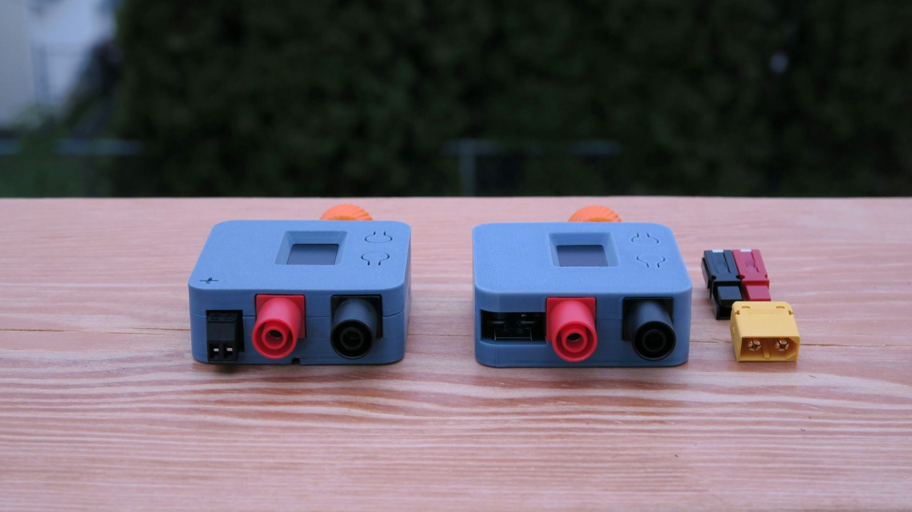

Shield: [![CC BY-SA 4.0][cc-by-sa-shield]][cc-by-sa]

This work is licensed under a
[Creative Commons Attribution-ShareAlike 4.0 International License][cc-by-sa].

[![CC BY-SA 4.0][cc-by-sa-image]][cc-by-sa]

[cc-by-sa]: http://creativecommons.org/licenses/by-sa/4.0/
[cc-by-sa-image]: https://licensebuttons.net/l/by-sa/4.0/88x31.png
[cc-by-sa-shield]: https://img.shields.io/badge/License-CC%20BY--SA%204.0-lightgrey.svg

# Quick links
- PocketPD's Firmware - [GitHub](https://github.com/CentyLab/PocketPD)
- PocketPD's Project Page - [Hackaday.io](https://hackaday.io/project/194295-pocketpd-usb-c-portable-bench-power-supply)
- CentyLab website - [CentyLab.com](https://centylab.com)
- CrowdSupply Page - [CrowdSupply.com](https://www.crowdsupply.com/centylab/pocketpd)

# Hardware Overview
- Design Files - .kicad_*
	- KiCad design files
- Gerber files - _Gerber.zip; _Gerber.pdf
    - PCB copper and drill file for fabrication
- Schematic file - _Schematic.pdf
    - Schematic in PDF format
- BOMs - _bom.cvs
    - Bill of material for the PCBA and also the unit assembly for additional parts
- 3Ds files
    - Model ready for 3D printing for housing and encoder knob. You can view the models online directly on GitHub. Else, check out free online viewer [3dviewer.net](https://3dviewer.net/)
	- 3D model for the whole PocketPD PCB and Connector if you would like to model your own case.

 
